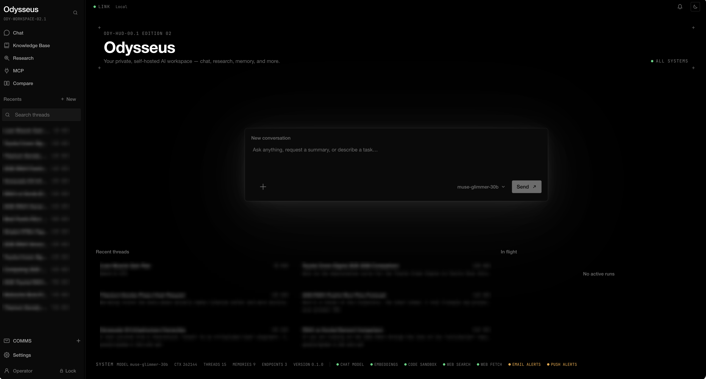

# Odysseus
───────────────────────────────────────────────

 ⊹ ࣪ ˖ ૮( ˶ᵔ ᵕ ᵔ˶ )っ  Odysseus (Revamped)

───────────────────────────────────────────────

A self-hosted AI workspace that runs on your own hardware against your own data. Local-first, encrypted at rest, built for personal use (1 user).



I rebuilt the entire platform on top of **Pydantic AI + FastAPI**. The agent loop is done and so is most of the workspace around it: chat, research, a knowledge base, email, calendar, scheduled tasks, projects with a real Code mode, memory, MCP, a secrets vault, and encrypted backup all run today. What's left is a short list, and it's at the bottom.

## The idea

**Pydantic AI is the engine; the code I wrote around it is the chassis.** All agentic reasoning — the model call, tool selection, typed-arg validation, the within-turn tool→observe→continue loop, retries, fallback, output validation, history processing — runs *through* Pydantic AI. Everything that turns one model run into a durable, observable, resumable product — run lifecycle, the event stream, disconnect-survival and resume, cancellation, timeouts, persistence, access policy, the verifier/loop-break meta-loop — is what I built. Like I said up top, Odysseus assumes one powerful local host, a single operator, and models capable of native tool calling.

## What runs today

**The core loop.**

- **Chat.** Every message runs the full agent path rather than a pre-classified route: the model sees the whole permitted tool catalog and decides what to call. Replies stream incrementally, survive a disconnect, and resume on reconnect. Conversations branch through regenerate, edit, and rewind.
- **The agent engine.** A Pydantic AI `Agent` driven node by node, wrapped in a meta-loop — an always-on no-progress guard plus an opt-in post-turn verifier — with first-turn auto-titling.
- **Sensitive-action approval.** A powerful tool call parks the run and asks before it executes; approving or denying resumes it. Approvals can be scoped to a conversation, and those grants are listable and revocable.
- **The agent's task list.** The model keeps a visible plan for the turn, streamed as it mutates.
- **Conversation compaction.** The one context reduction in the product, and it fires on measured pressure: when a thread reaches your share of the model's context window, earlier turns fold into a utility-model summary and the chat carries on. The transcript keeps everything — only the model's replay narrows.

**Work surfaces.**

- **Projects and Code mode.** A project is a directory you work in, and the whole app scopes to it. A `code` conversation works in a git worktree on a branch named for the thread; **your own checkout is written by exactly one thing — a merge you press.** Deleting a thread with unmerged commits is refused unless you say to discard it.
- **Sandboxed code, the View, and previews.** The agent runs code in a host-isolated, per-conversation container that fails closed and never touches the host, and publishes output to the View — one versioned surface where each result is a snapshot you can star and return to, optionally fronted by a live reverse-proxied head.
- **Research mode.** A thread that asks once what you actually want to know, reads widely before it concludes, never re-reads a source it has already read, and attributes every claim to the page it came from. It is a *conversation*, not a report generator, so you can push back on it halfway through — and the agent can open one for you from another thread and hand you the answer later.
- **Knowledge Base.** Point it at folders of your own documents and retrieve from them by meaning; sources, index stats, reindex and rebuild are all yours to drive.
- **Uploads.** Files as context, through a sealed file store with off-request text extraction, corpus-indexed.
- **Compare.** One prompt fanned to two models side by side — each pane a real, resumable conversation rather than a preview.
- **Skills.** Reusable know-how the agent accumulates and applies to later tasks.

**Reach.**

- **Web search and fetch.** A managed SearXNG instance with no operator setup, plus a containerized headless browser that renders a page to Markdown. SSRF-guarded on every request; untrusted content is marked as data before it reaches a prompt.
- **Email.** Multiple accounts over IMAP/SMTP, Gmail, Microsoft Graph or JMAP, with OAuth where the provider wants it — plus AI triage (urgency, tagging, summaries) and reply drafts that match how you actually write.
- **Calendar.** Local-first, with CalDAV sync, `.ics` import/export, recurrence, and natural-language entry — "lunch Friday 1pm" becomes a draft, with the model reading the phrase and the code doing the date arithmetic.
- **Tasks.** Scheduled and webhook-triggered jobs the agent runs unattended within a pre-authorized scope. An out-of-scope sensitive action still parks for approval exactly like an interactive run.
- **Notifications.** A second, separately-versioned event stream for approvals, failures, completions and reminders — and the two worth interrupting you for (an approval request and a reminder) also go out by email through your own connected mailbox and by push to whatever notifier you already run.
- **MCP.** Register external tool servers; their tools are sensitive by default until you trust them.
- **Integrations.** Preset connectors to third-party HTTP services, with encrypted credentials.

**Your controls.**

- **Model registry.** Named roles (`main`, `utility`, `embedding`) map to ordered fallback chains; endpoints discover their served models at runtime; conversations can override the model; keys are encrypted at rest. Each endpoint is typed by a provider adapter — OpenAI-compatible, or native Anthropic/Google.
- **Long-term memory.** Store, view, edit and delete entries, with hybrid semantic-plus-keyword recall that degrades to keyword-only when the vector store is unavailable.
- **Tool catalog.** Every registered tool is listed and individually switchable.
- **Offline mode.** Manual or auto-detected; web capabilities suspend themselves and say so.
- **Vault.** A password manager layered on the at-rest encryption; agent access is approval-gated.
- **API tokens.** Scoped tokens and inbound webhooks for programmatic access.
- **Backup and restore.** Encrypted export under a separate backup secret, with merge-import that avoids duplicates.
- **Health.** Per-capability status covering model, embeddings, sandbox and search, derived in the backend and rendered on the home page.
- **Auth and at-rest encryption.** A global auth gate (cookie or bearer); all user data AES-256 encrypted under a password-derived, memory-only, lock-until-unlocked key.

## What's left

- **Task automation depth** — predefined actions and chaining, natural-language schedule parsing, and event triggers beyond the inbound webhook.
- **The health screen** — it's the one surface still on fixtures. It wants per-service latency, a baseline and a status history, and the backend measures none of those yet. Real capability health lives at `/overview` and the home page renders it.
- **A deployable frontend build** — `bun run dev` is fine, but `bun run build`'s server output is blocked on a `@solidjs/start` alpha upgrade. See `frontend/CLAUDE.md`.

## Out of scope, on purpose

Some things were built and then deliberately removed, because they were redundant, better done elsewhere, or not worth their maintenance:

- **Local model serving and the "Cookbook."** Odysseus no longer downloads, quantizes or serves models. It works off **endpoints** — you point it at LM Studio, vLLM, llama.cpp or a hosted provider, and the registry takes it from there. Serving models was a second product wearing this one's clothes.
- **The document editor, the gallery, the in-browser code runner, and the operator's host shell.** The agent still writes files, runs code, and works a real terminal inside a project worktree; what went away was the standalone UI for each.

## Architecture

There are two halves, kept cleanly separate: the frontend renders and captures intent, and **all the logic lives in the backend.** See [`docs/architecture/`](docs/architecture/README.md) for the full design and [`docs/architecture/decisions.md`](docs/architecture/decisions.md) for every decision and its trade-offs.

```
frontend/     SolidJS / SolidStart SPA · TypeScript · Tailwind v4 · Vite
              Instrument design system (Ink / Paper) · typed model.ts/data.ts seam;
              every surface wired to the real backend except the health screen

backend/      Pydantic AI + FastAPI  (Python 3.14, uv-managed)
  app.py        FastAPI assembly: middleware, auth gate, router registration, shared singletons
  harness/      app-assembly substrate: feature manifests, discovery, start/stop lifecycle ordering
  core/         foundation: config · db · crypto/vault (at-rest encryption) · auth · write-behind
                worker · untrusted-content marking · SSRF guard · exceptions
  models/       SQLModel entities + schema (owner seam · per-column encryption · branch tree)
  runs/         Pillars I+II — the Run substrate + the frozen v1 event protocol
  agent/        Pillar III — the engine: orchestrator · node→event translator · meta-loop ·
                namer · compaction
  prompts/      the prompt library, split by durability (system_prompt vs instructions)
  tools/        Pillar III — the agent's tool catalog: namespacing + enable gate + thin adapters
  services/     capabilities: llm/registry · providers · memory · conversations · sandbox ·
                search · webfetch · corpus · projects · mail · calendar · skills · mcp ·
                integrations · backup · scheduler · notifications · vault
  routes/       thin FastAPI routers, one per surface (overview is the home aggregate)
  migrations/   Alembic — schema auto-upgraded to head on startup
  evals/        retrieval + end-to-end evaluation harness
  tests/

docs/architecture/  backend design — the engine/chassis split, the three pillars, and the
                    D-numbered decision register (including the angles that were rejected)
docs/design-system.md  the frontend's visual language
```

The central abstraction is a **Run**: one server-side, background-executing unit of work for a single request. Chat turns and agent tasks are all Runs, so I only have to write continuity, resume, cancellation, timeouts, and metrics **once** — everything inherits them. The backend is an **origin-agnostic API**: it makes no assumption about who serves the frontend. The whole thing rests on three pillars — the Run substrate, the event protocol, and the agent engine plus tools — detailed in [`docs/architecture/README.md`](docs/architecture/README.md). The tool layer has its own write-up in [`docs/architecture/40-tools-and-toolsets.md`](docs/architecture/40-tools-and-toolsets.md).

## Running it

**Backend** (requires [uv](https://docs.astral.sh/uv/)) — platform-agnostic (Linux / macOS / POSIX), no OS-specific dependency:
```bash
cd backend
uv sync                                       # creates .venv (Python 3.14), installs deps
uv run python dev.py                          # http://localhost:8000  (/health to check)
uv run pytest                                 # the test suite
uv run ruff check .                           # lint
```
`dev.py` is `uvicorn app:app` with auto-reload, minus the directories that hold runtime state rather than source. To run without reload (production), use `uv run uvicorn app:app` directly.

On first run, create the operator account via the frontend (the password you choose also derives the at-rest encryption key). A container runtime (Docker/Podman) is needed for the code sandbox, web fetch and managed web search; without one, those capabilities report unavailable rather than falling back to the host.

**Frontend** (requires [bun](https://bun.sh)):
```bash
cd frontend
bun install
bun run dev         # http://localhost:5173
bun run typecheck   # tsc --noEmit (scoped to src/)
bun run lint        # eslint + prettier --check
bun run test        # the fast unit suite
```
> **NOTE — `bun run build` does not currently produce a working server bundle.** Its Nitro output returns HTTP 500 on every request, via an exact-pinned transitive dependency of the `@solidjs/start` 2.0 alpha. Development is unaffected; anything needing a deployable artifact is blocked on that upgrade. Details in `frontend/CLAUDE.md`.

> **NOTE — fonts.** UI typography is fully self-hosted: **JetBrains Mono** is served as a Nerd Font build (subset to the ranges the UI uses plus Braille Patterns), so the spinners' **Braille** glyphs render natively — nothing to install. The mono font is regenerated by `bun run build:fonts` in `frontend/` (needs `python3` with `fonttools` + `brotli`).

## Security & privacy

Odysseus can do powerful things on your machine — sandboxed and (with approval) host code execution, file writes, email, web research — so I don't treat security as an afterthought. The full details are in [SECURITY.md](SECURITY.md).

- **Single operator.** All data and features belong to *you* — the sole user. Every request is authenticated before any feature is reached; every record is owner-stamped against a future multi-user seam.
- **Sensitive actions require approval.** The agent pauses and asks before anything powerful or hard to reverse (running a shell command or code on the host, file writes, sending email, configuration, vault) takes effect. Sandboxed code is *not* sensitive — it's isolated and containerized from the host.
- **Your checkout is yours.** In Code mode the agent works only on its own branch in a git worktree; the one thing that writes your working tree is a merge you press.
- **Encrypted at rest.** All user data is AES-256 encrypted; auth secrets are one-way hashed. The key is derived from your password and lives only in memory — no OS keystore, nothing readable on disk, re-locked on restart.
- **Untrusted content is data, not instructions.** External content (web pages, fetched URLs, files) is wrapped and marked so the model treats it as data before it enters a prompt.
- **Local-first.** Nothing leaves the machine unless you configure an external provider or integration.
- Serve plain HTTP only on `localhost`/trusted LAN; put a TLS-terminating reverse proxy in front for anything reachable beyond your machine.

## Data

All user data lives under `data/` and is **gitignored** — databases, uploads, keys, generated media. Never commit anything from `data/`, `.env`, or `logs/`.

## Contributing

It's still early days, but help is more than welcome. There are exactly two authoritative inputs: the [architecture and its decision register](docs/architecture/README.md) (the *how* and the *why*), and the capabilities of FastAPI + Pydantic AI. The black-box spec this rebuild was seeded from has been **retired** — it kept the rebuild on track and the build outgrew it; a requirements document that no longer leads the code is one that quietly lies about it. Requirement ids (`XC-*`, `AE-*`, `DR-*`) still appear in docstrings here and there: they're historical, and where one disagrees with the code, **the code is right**. I don't use the deleted pre-reset code as a reference either — PewDiePie's original was vibe-coded.

A decision with real trade-offs belongs in `docs/architecture/decisions.md`, along with the angles that were rejected — git is the audit trail, and the rejected angles are what a future reader would otherwise have to re-derive.

## License
MIT — see [LICENSE](LICENSE) and [ACKNOWLEDGMENTS.md](ACKNOWLEDGMENTS.md).

```
                                  |
                                 |||
                                |||||
                  |    |    |   |||||||
                 )_)  )_)  )_)   ~|~
                )___))___))___)\  |
               )____)____)_____)\\|
             _____|____|____|_____\\\__
             \                       /
       ~^~^~~^~^~~^~^~~^~^~~^~^~~^~^~~^~^~~^~^~
               ~^~  all aboard!  ~^~
       ~^~^~~^~^~~^~^~~^~^~~^~^~~^~^~~^~^~~^~^~
```
